# 天気予報通知システム
当日の天気予報をLineで通知するシステム。

# ビジネスルール
- 天気予報の情報を取得する
- 天気予報の情報を通知する

# 必要な機能の洗い出し（設計時に作成）
- 気象庁のAPIから天気予報情報を取得する機能
  - エンドポイント：https://www.jma.go.jp/bosai/forecast/data/overview_forecast/350000.json
    - レスポンス例：
       {"publishingOffice":"下関地方気象台","reportDatetime":"2025-01-29T16:37:00+09:00","targetArea":"山口県","headlineText":"","text":"　山口県は、寒気の影響により、おおむね曇りで雪や雨が降っている所があります。\n\n　２９日は、寒気の影響によりおおむね曇りで雪か雨が降る所があるでしょう。\n\n　３０日は、寒気の影響によりおおむね曇りで雪か雨が降る所がありますが、高気圧に覆われて晴れとなる所もあるでしょう。"}
- APIのレスポンスから目的のデータを取り出す機能
  - レスポンスの"text"の値を取り出す。
- Line Notifyで通知を送信する機能

# 各機能の依存関係

```mermaid
classDiagram 

namespace Entity {
  class iNotifier {
    execute(notification_message)
  }
  class ForecastData 
  class iWeatherForecaster {
    execute()
  }
}

<<interface>> iNotifier
<<interface>> iWeatherForecaster
<<DataStructure>> ForecastData

namespace UseCase {
  class InputData
  class iWeatherForecastAdapter {
    execute(raw_input_data) : InputData
  }
  class WeatherForecastUsecase {
    get_and_notify_weather_forecast()
    input_data2forecast_data(inputdata: InputData): ForecastData
    forecast_data2output_data(forecast_data: ForecastData): OutputData
  }
  class iNotificationAdapter {
    execute(forecast_data: OutputData)
  }
  class OutputData
}

<<interface>> iWeatherForecastAdapter
<<interface>> iNotificationAdapter
<<DataStructure>> InputData
<<DataStructure>> OutputData

namespace InterfaceAdapter {
  class WeatherForecastFromJapanMeteorologicalAgencyAdapter
  class WeatherForecastFromJapanMeteorologicalAgencyData
  class LineNotifyAdapter
  class LineNotifyData
}

<<DataStructure>> WeatherForecastFromJapanMeteorologicalAgencyData
<<DataStructure>> LineNotifyData

namespace Infrastructure {
  class LineNotify
  class WeatherForecastFromJapanMeteorologicalAgency
}



%% Entity の継承関係
LineNotify --|> iNotifier 
WeatherForecastFromJapanMeteorologicalAgency --|> iWeatherForecaster 

%% Interface Adapter の継承関係
WeatherForecastFromJapanMeteorologicalAgencyAdapter --|> iWeatherForecastAdapter 
LineNotifyAdapter --|> iNotificationAdapter 



%% use case と entity の依存関係
WeatherForecastUsecase --> iWeatherForecaster
WeatherForecastUsecase --> iNotifier
WeatherForecastUsecase --> ForecastData

%% use case 内の依存関係
WeatherForecastUsecase --> InputData
WeatherForecastUsecase --> OutputData
WeatherForecastUsecase --> iWeatherForecastAdapter
WeatherForecastUsecase --> iNotificationAdapter

%% Interface Adapter 内、およびInterface Adapterと Use case 間の依存関係
WeatherForecastFromJapanMeteorologicalAgencyAdapter --> InputData
WeatherForecastFromJapanMeteorologicalAgencyAdapter --> WeatherForecastFromJapanMeteorologicalAgencyData

LineNotifyAdapter --> iNotificationAdapter
LineNotifyAdapter --> LineNotifyData

%% Interface Adapter と Infrastructure 間の依存関係
LineNotify --> LineNotifyData
WeatherForecastFromJapanMeteorologicalAgency --> WeatherForecastFromJapanMeteorologicalAgencyData

```

